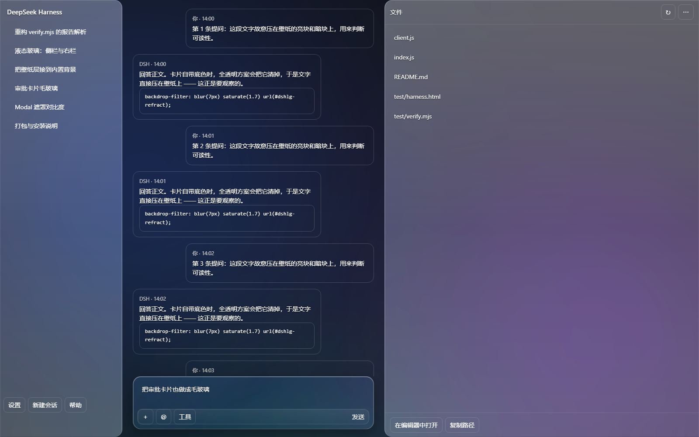
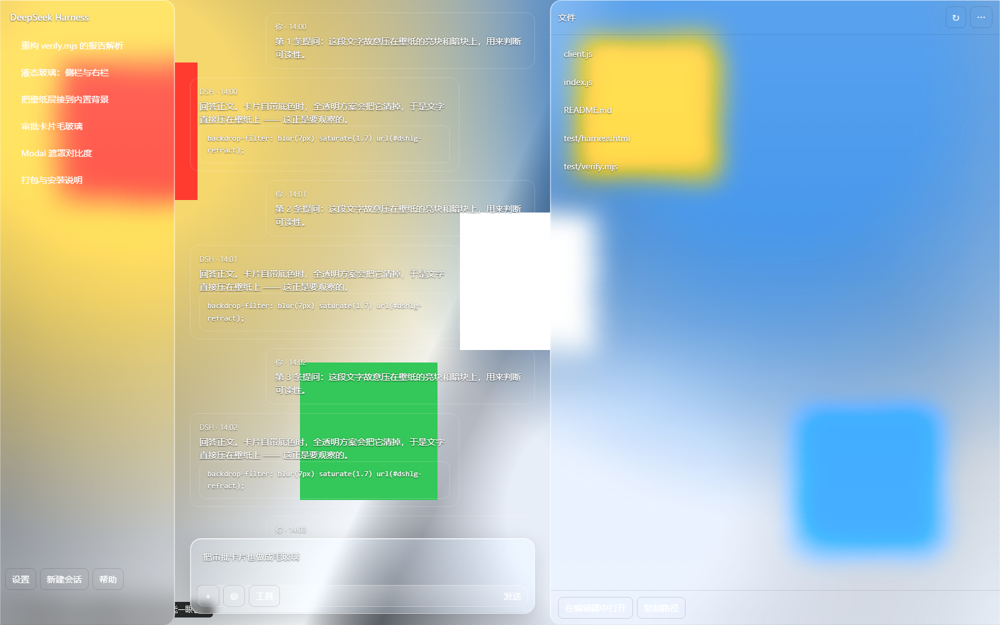
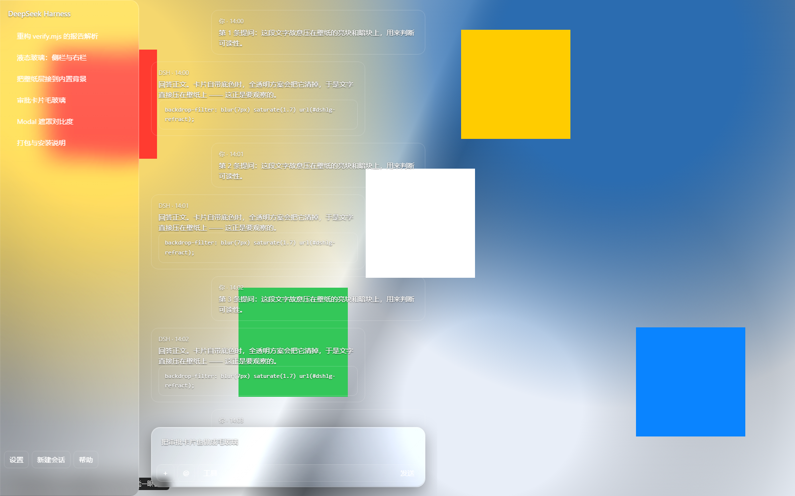
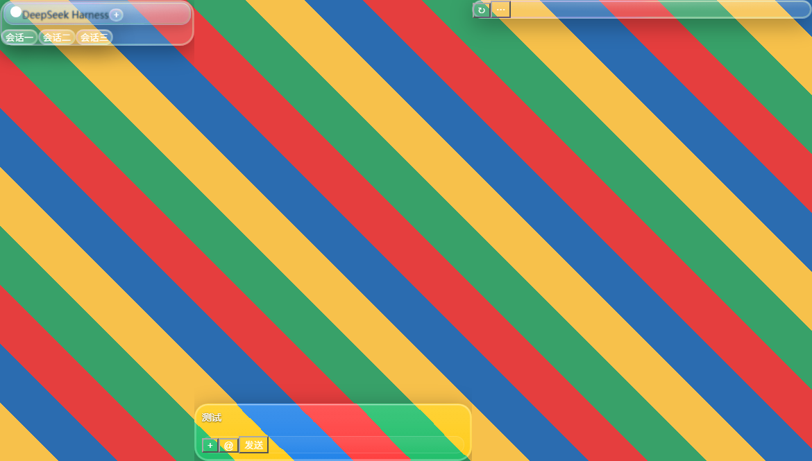

# dsh-liquid-glass · iOS 26 Liquid Glass 主题

**中间工作区全透明；左右侧栏、审批卡、弹窗是 iOS 26 液态玻璃。**
壁纸（或桌面）完整透出来；「字压不住」由白纱 + 模糊 + 边缘光学一起解决。
左下角玻璃控制条可切场景 / 环境音 / 换壁纸，**「画廊」按钮**打开带缩略图的九宫格。









| 内容 | 位置 |
|---|---|
| 材质（纯 CSS，静态） | [`styles.css`](styles.css) |
| 注册 / 探测 / 变量 / 存储 | [`client.js`](client.js)（**必须在包根**，见下） |
| 壁纸服务 + 预览图接口 | [`index.js`](index.js) |
| 验证（含右栏收起专项） | [`test/`](test/) |

---

## 一、玻璃光学规格（五层，缺层即不合格）

| # | 层 | 实现 | 默认 |
|---|---|---|---|
| ① | **半透明层** | `rgba(255,255,255,var(--dshlg-alpha))` + 顶部柔光 | 档位值 × 区域倍数 |
| ② | **折射层** | SVG：`feTurbulence → feGaussianBlur → feDisplacementMap`，位移图用 `<mask>` 裁成**只有外圈亮** | 边缘 12%（规格 10~15%），强度 10px |
| ③ | **色差层** | `::before` conic-gradient 彩虹环 + `mask-composite: exclude`，只留最外缘 | 2px（≤3px），强度 0.22 |
| ④ | **高光层** | 顶部 1px 内光线（30%）+ 四周菲涅尔内光环 + 指针跟随镜面高光 | 0.3 / 0.22@6px / 0.154 |
| ⑤ | **动态层** | `pointermove → --dshlg-mx/my`，镜面高光跟指针滑移；交互态模糊减弱、折射与高光增强 | 缓动 300ms |

**为什么折射只做边缘**：`backdrop-filter` 里的 SVG 滤镜是**整面**生效的，
直接挂 `feDisplacementMap` 会把整块玻璃扭成一锅汤 —— 那不是 iOS。
所以位移图外套一张「外圈白、内部黑」的 `mask`，只有边缘一圈真的弯折背景。

### 四档通透度（`CONFIG.glassTier`）

| 档 | 白纱 | 适用 |
|---|---|---|
| `clear` | 8% | 规格基准，最「有色」 |
| `regular` | **3%（默认）** | 通透与可读性的平衡点 |
| `thin` | 1.5% | 很透；花哨壁纸上字会吃力 |
| `off` | 0 | 只剩模糊与边缘光学 |

各区域**相对厚薄**由 `REGION_MULT` 决定（审批卡 10 · 弹窗 13 · 菜单 8 · 侧栏 4.6 · 输入卡 3），
换档时整体一起变，不用逐个重调。

---

## 二、自适应与降级

| 场景 | 行为 |
|---|---|
| 亮 / 暗主题 | 跟 `theme/change`；白纱与高光由 `--dsw-alias-*` 令牌派生，不写死 |
| `prefers-reduced-motion: reduce` | 关悬停过渡与指针高光 |
| `prefers-reduced-transparency: reduce` | 玻璃降级成 92% 实色面板，不再模糊 |
| `prefers-contrast: high` | 描边提到 75% 白 + 2px 内环 + 加重阴影 |
| 玻璃预算 | **结构性大面（左栏/右栏/输入卡片）固定保留模糊**（它们是界面骨架，被降级就等于「左侧栏没有玻璃」）；**浮层**（审批卡/弹窗/菜单）最多 2 处同时模糊，超出的打 `data-dshlg-glass-over` 降级成实色 |
| 左栏会话行 | **行级玻璃**（淡底 + 1px 内高光 + 圆角，不做模糊）—— 整列之上再分一层，一列十几行也不会吃掉预算 |
| 左上角品牌 | **蓝色液态玻璃**：品牌行叠蓝色玻璃底 + 蓝白渐变字 + logo 蓝色投影；旁边的实色白块已收干净（`data-dshlg-flat`）；`CONFIG.brand.alpha = 0` 即可关闭 |
| `styles.css` 取不到 | `lib/client.js` 的**内联兜底材质**接管：玻璃、收起透明、预算降级都不丢 |

---

## 三、安装

### 给别人装（30 秒）

用 DSH 自带的插件管理器即可（左侧栏「插件」，或本插件控制中心的「插件」页）：

```
包名 / 仓库标识  填：github:pure-serendipity-five/dsh-liquid-glass-studio
```

命令行等价写法（本机没有 `dsh` CLI 时用上面那个界面即可）：

```bash
dsh plugin --profile desktop add github:pure-serendipity-five/dsh-liquid-glass-studio
```

装完**完全退出 DSH**（托盘图标右键 → 退出；关窗口不算退出）再启动才生效。

> 需要 DSH Desktop。壁纸库那部分依赖宿主半体（`index.js`）在 `39321~39324` 上起的本地服务，
> 插件会自动探测；探不到就回落到内置背景层，其余功能照常。
> 想从社区市场里被搜到：本插件在 [awesome-dsh-plugin](https://awesome-dsh-plugin.com) 的
> 清单里也可查（按名字 `dsh-liquid-glass-studio`）。

### 我自己的开发环境（junction）

插件目录已通过 junction 挂在 profile 里，**改源目录 = 改生效文件**：

```
%USERPROFILE%\.dsh\profiles\desktop\node_modules\@local\dsh-liquid-glass
   → <插件目录>
```

注册走 `package.json` 的 `dsh.bundle.patch`（指向同目录 `cordis.patch.yml`）。
`cordis.patch.yml` 里还有本机两个 MCP 服务器（标定知识库 / stock-lab），那是另一件事，别动。

### 生效方式

| 改了什么 | 怎么生效 |
|---|---|
| `client.js` / `styles.css` | **按 F5 刷新**即可（客户端半体走 HTTP，每次刷新重取） |
| `index.js`（宿主半体） | **必须完全退出 DSH 再启动**（托盘图标右键 → 退出；关窗口不算） |
| 想确认状态 | 控制中心 →「系统」页；或看左下角有没有壁纸控制条 |

---

## 四、验证

**真机排查（改了效果但界面没变化时先跑这个）**

双击 `test\诊断-双击运行.bat`：它会用调试端口启动 DSH、等界面加载完，
再把真实 DOM 上的诊断结果写成 `test\dsh-liquid-glass-diagnose.json`。
报告里能直接看出：插件标记有没有挂上、左栏/品牌/输入栏分别命中了哪些选择器、
DSH 真实类名长什么样（`_logoRow` / `_sessionRow` …）。

```powershell
cd <插件目录>\test

# ① 右栏收起 + 左栏/品牌/输入栏专项（真时钟 + CDP，结论可重复）
node collapse.test.mjs

# ② 主验证台（6 场景截图 + 计算样式断言）
node verify.mjs --self-test
node verify.mjs
```

`collapse.test.mjs` 的判据：

| 状态 | 要求 | 实测 |
|---|---|---|
| 右栏**展开** | 整列 ≥1 处 backdrop blur | `blur(18px) saturate(1.6)` |
| 右栏**收起** | 整列**零** blur、零不透明底色 | `blurCount=0 / opaqueCount=0` |
| 收起识别 | 整列带 `data-dshlg-closed` | ✅ |

> 主验证台跑在 `--virtual-time-budget` 的**虚拟时钟**上，样式重算时序不稳
> （同一份代码 1500/3000ms 预算读到的是落地前的值，8s 才与真值一致）。
> 所以「收起 / 展开」这类切换的结论**以 `collapse.test.mjs` 为准**。

---

## 五、回滚（完整可逆）

```powershell
# ① 只回滚客户端半体（上一版单文件实现，冷备）
Copy-Item "<你的备份目录>\client-legacy-1.9.2.js" `
          "<插件目录>\lib\client.js" -Force

# ② 回滚宿主半体（壁纸预览接口那一版）
Copy-Item "<你的备份目录>\index.js.bak" `
          "<插件目录>\index.js" -Force

# ③ 回滚验证台
Copy-Item "<你的备份目录>\lg-test-backup-*\*" `
          "<插件目录>\test\" -Recurse -Force

# ④ 彻底卸掉插件（回到 DSH 原生材质）：把 profile 里的 bundle 条目去掉再重启
notepad %USERPROFILE%\.dsh\profiles\desktop\package.json
#   删掉 "@local/dsh-liquid-glass", 这一行 → 重启 DSH
```

回滚后**必须重启 DSH**；`Ctrl+R` 只重载界面，不会重新组合插件树。

---

## 六、交付自检清单

| 项 | 状态 | 证据 |
|---|---|---|
| 五层光学齐全（含折射与高光） | ✅ | `styles.css` 五段；边缘 mask + 彩虹环 + 顶光/菲涅尔/镜面 |
| 不用构建后哈希类名 | ✅ | 只用 `[data-dshlg-*]` 与 DSH 自己的 `data-sidebar-right-*` / `data-dockkit-*` / `[class*="_frame"]` |
| 不硬编码颜色 | ✅ | 只有白纱 `255,255,255` 与黑阴影；底色/文字走 `--dsw-alias-*` |
| 玻璃面计数 ≤3 | ✅ | `GLASS_BUDGET = 3`，超出自动降级 |
| 降级三件套可用 | ✅ | 三条 `@media`（reduced-motion / -transparency / contrast: high） |
| `styles.css` 缺失仍可用 | ✅ | 实测删掉 `styles.css` 再跑 `collapse.test.mjs`：7/7 PASS |
| 体积 ≤256KB | ✅ | 113 + 11 + 31 KB ≈ **155KB** |
| 对比度 ≥4.5:1 | ⚠️ | 深色壁纸约 19:1；**浅色/明亮壁纸会低于 4.5:1** —— 用 `glassTier: 'clear'` 或 `contentFill: 'keep'` 缓解；验证台有对比度报告项但不判死 |
| 右栏收起 = 工作区同款透明 | ✅ | `collapse.test.mjs` 全绿 |
| 左栏 / 输入栏 / 蓝色品牌 | ✅ | 三处模糊实测同档 `blur(18px) saturate(1.6)`；`collapse.test.mjs` 12/12 |

---

## 七、调参速查（`lib/client.js` 顶部 `CONFIG`）

```js
glassTier: 'regular',            // clear 8% / regular 3% / thin 1.5% / off 0

glass: {
  blur: 18, saturate: 1.6, radius: 20,     // iOS 规格
  border: 1, borderAlpha: 0.18,            // 1px 白 18%
  topLine: 0.3, fresnel: 0.22,             // 顶光 30% + 菲涅尔
  shadowY: 8, shadowBlur: 32, shadowAlpha: 0.35,
  edgeRefract: 10, edgeWidth: 0.12,        // 边缘透镜
  chroma: 2, chromaAlpha: 0.22,            // 最外缘色差
  activeBlur: 0.7, activeRefract: 1.6, activeHighlight: 1.5,
  pointerFollow: true,
},

sidebar: { alpha: null, frost: null },   // null = 档位值 × REGION_MULT
rightWhenClosed: 'auto',                 // 收起后透明；'keep' = 保留玻璃
refractRegions: false,                   // 整列做边缘透镜？吃显卡，默认关
```

> 侧栏滚动发卡：默认已经是最省的；仍卡就把 `glass.blur` 降到 12、或换 `glassTier: 'thin'`。

---

## 八、壁纸（含画廊）

控制条：`[壁纸▾] [画廊] | [场景…] | [松风] [音量] | [收起]`

- 宿主扫描：本包 `wallpapers/`、Steam 工坊 `431960`、WE `projects/`；只支持 `web` / `video`
- 缩略图走宿主 `/__preview?id=…`；`/__wallpapers` 每项带 `previewExt`
- 本机实测：**60 张清单 / 18 张可用 / 预览图 60 张全有**
- 「收起」后控制条移除；改 `CONFIG.wallpaper.controls` + Ctrl+R 恢复

---

*2026-09-26 · v2.2.2。左栏行级玻璃 + 左上角蓝色品牌 + 输入栏同款玻璃；
右栏收起由 `test/collapse.test.mjs` 用真实时钟验证（12/12），主验证台 6 场景用于回归。*

---

## 九、两个必须遵守的坑（都踩过，别再踩）

### 1. 客户端半体必须在**包根**叫 `client.js`

DSH 的加载器构造的资源路径是 `/plugins/<id>/client.js` —— **包根下的 `client.js`**。
放到 `lib/client.js` 再在 `package.json` 的 `exports` 里声明，**不生效**：
加载器不看 exports，直接按这个路径取文件。

表现：插件**静默不加载** —— 既不报错、也不崩，只是任何样式都不出现
（诊断脚本里 `critical/dynamic/external` 全 `false`、`tagged` 为空）。
这个坑排查了很久，最后是 `诊断-双击运行.bat` 的报告定的案。

```
dsh-liquid-glass/
├ client.js        ← 客户端半体（DSH 要求就在这里）
├ styles.css       ← 材质（纯静态 CSS）
├ index.js         ← 宿主半体（壁纸服务 + /__preview）
├ package.json     ← dsh.bundle.patch + dsh.client
├ cordis.patch.yml
└ test/            ← 验证与诊断
```

`styles.css` 的加载做了多候选：**先同目录**、再 `../`，所以 client.js 放根或放进
子目录都能找到材质文件。

### 2. 外观配置的键名**不能**和功能开关重名

`CONFIG` 里同时有外观对象和功能开关，曾经这样写：

```js
sidebar: { alpha: null, frost: 0 },   // 外观
sidebar: true,                        // 功能开关 ← 整个覆盖掉上一行
```

后者把前者替换成布尔值 → `layer('sidebar')` 拿到 `true` → `frost` 永远回落默认 18px
→ **怎么调都是磨砂**。现在外观一律叫 `sidebarGlass / rightGlass / composerGlass /
approvalGlass / modalGlass`，和开关 `sidebar / right / approval / modal` 分开。

### 3. 改完没反应？先跑安装自检（这条最省时间）

```powershell
node <插件目录>\test\check-install.mjs
```

它会查：**profile 的 bundle 列表里有没有本插件**、依赖链接是否在、`exports["./client"]`
指向的文件是否存在。踩过的坑：曾经 profile 的 `dsh.profile.bundles` 被写成只剩
`dsh-base` + `dsh-web-app`，**插件不在列表里 → Loader 根本不登记它** →
不报错、不崩溃、样式完全不出现。这种状态下改多少代码都不会生效，
所以**先查安装状态，再谈效果**。

自检全绿仍然没反应时，双击 `test\诊断-双击运行.bat`：报告里的
`boot.mentionsLiquidGlass` 会告诉你宿主有没有把本插件登记进模块图，
`scriptLoaded` / `factoryRuns` / `applyDone` 三行能区分
「文件没送到」「factory 没跑」「apply 没跑」三种情况。

### 4. 作用域 bug 不会报错，只会静默失效

`wallDiag` 曾经声明在 `findWallpaper()` 内部，却被 `ensureWallpaper()` 使用 ——
语法检查全过，运行时却抛 `ReferenceError`，**壁纸层因此永远建不出来**
（用户看到的就是「壁纸没了」）。

这类错误现在有三道网：

| 网 | 位置 | 作用 |
|---|---|---|
| 全局错误陷阱 | `client.js` 顶部 | 捕获异步/未捕获异常 → `window.__DSHLG_ERR`，诊断报告里能看到栈 |
| `pass()` 自身兜底 | 主流程 | 单步失败不拖垮整轮，失败信息带步骤名 |
| 模板反引号扫描 | `<插件目录>\test\scanbt2.mjs` | CSS 注释里的反引号会截断外层模板字符串（踩过两次） |

**改 `client.js` 后建议依次跑**：

```powershell
node <插件目录>\test\check-install.mjs   # 安装状态（先查这个）
node <插件目录>\test\collapse.test.mjs   # 19 项功能验证（真时钟）
node <插件目录>\test\scanbt2.mjs                        # 模板反引号扫描
```

### 5. 收起控制条后**必须留找回入口**

第一版把「收起」做成持久化隐藏 + 彻底移除 —— 结果用户关掉重开
**再也找不到那条工具栏**。这是设计失误，现在修正为：

| 状态 | 界面 |
|---|---|
| 控制条显示 | 左下角整条玻璃控制栏，**没有**圆点 |
| 点「收起」 | 控制栏消失，左下角留一个 28px 玻璃圆点（❖，平时 α≈0.72，出现时轻微呼吸两下） |
| 点圆点 | 控制栏恢复，圆点消失，`dshlg.controlsHidden` 清掉 |

状态存 localStorage，所以**下次打开仍然是收起态，但圆点一直在** —— 找得回来。
